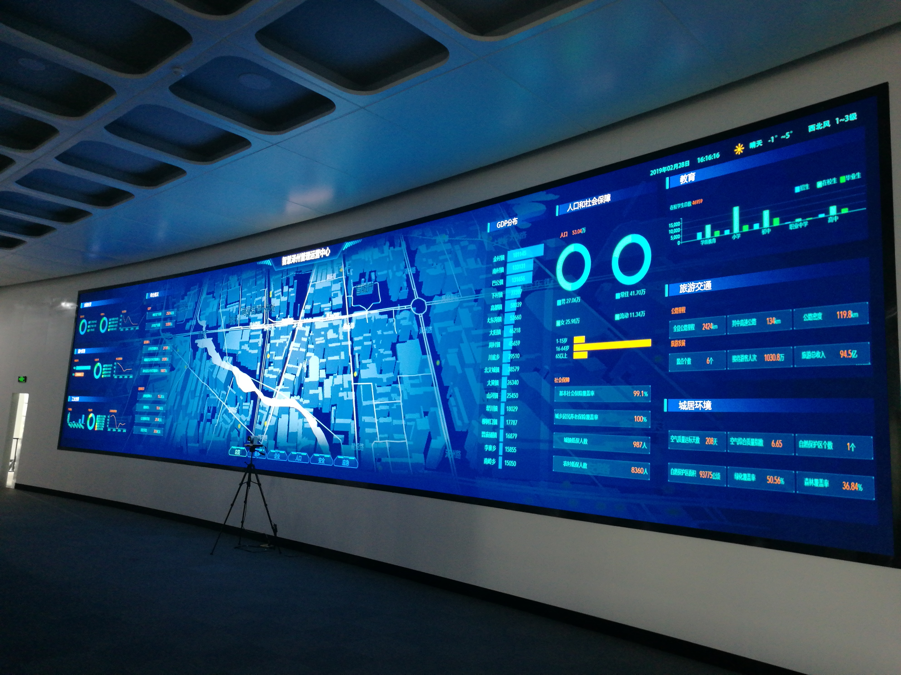
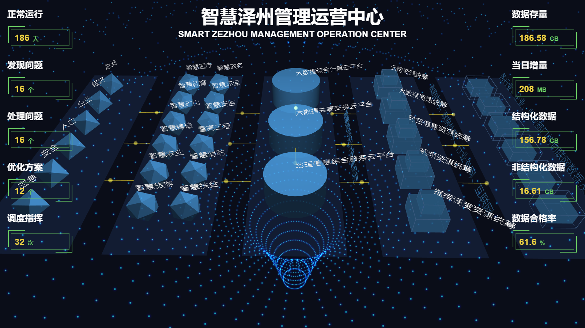
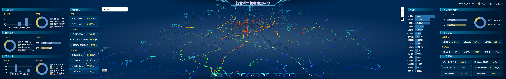
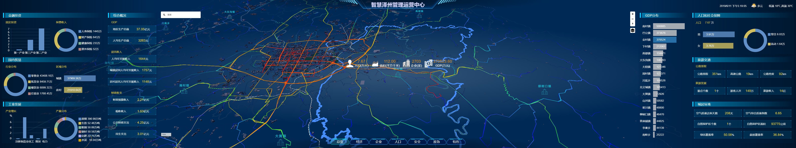
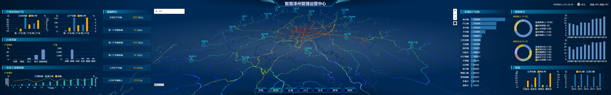
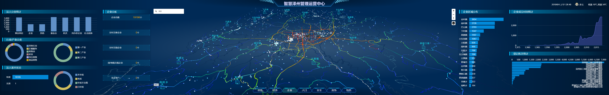
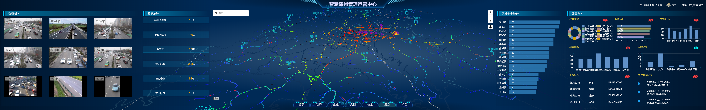

## 智慧城市管理运营中心
1、[技术栈介绍](#example-1)

2、[项目结构](#example-2)

3、[新页面添加流程](#example-3)

4、[打包发布](#example-4)

5、[项目截图](#example-5)


<h3 id="example-1">1、技术栈介绍</h3>

1、使用到的插件：
  "vue": 项目的基本框架
  "vue-grid-layout": 基于vue的布局插件
  "vue-router": vue路由插件
  "vuex": 基于vue的数据仓库
  "dc.js": 基于d3和crossfilter的可视化图表插件
  "@turf/turf":
  "@tweenjs/tween.js":
  "axios": 用于发起数据请求
  "echarts":
  "echarts-gl":
  "echartslayer":
  "element-ui": 在旧版本中用于布局（新版已弃用）
  "jquery":
  "lib-flexible": 用于设置页面的根元素font-size，用于计算rem
  "mapbox-gl":
  "mockjs": 用于模拟接口，返回模拟数据
  "three":
  "three-orbitcontrols":

<h3 id="example-2">2、项目结构</h3>

结构说明：
```
/mapbox-ioc
    ├─build             打包配置文件
    ├─config            运行环境配置
    ├─node_modules      项目依赖
    ├─src               项目源码
    │  ├─assets           资源文件（最终被打包到app.js中）
    │  │  ├─css             样式文件
    │  │  │  ├─index.css      全局样式，作用见注释
    │  │  │  ├─layout.css     新版本中的布局样式
    │  │  │  └─mapbox.css     地图弹窗样式
    │  │  ├─img             项目中用到的图片
    │  │  │  ├─background     新版本中头部背景和导航按钮背景
    │  │  │  ├─box-external   旧版本中盒子背景
    │  │  │  ├─box-internal   旧版本中盒子背景
    │  │  │  ├─emergency      应急页面中过滤地图数据的按钮
    │  │  │  ├─emergencyImg   应急页面中地图动画图标
    │  │  │  ├─header         旧版本导航按钮背景
    │  │  │  ├─map            旧版本地图框
    │  │  │  ├─svg            新版本地图弹窗中使用的图表
    │  │  │  ├─background.jpg *旧版本页面背景图（弃用）
    │  │  │  └─gradient.png
    │  │  ├─js              通用js文件
    │  │  │  ├─charts.js      为dc图表添加默认配置，绘制图表时使用（因全局都有使用，建议不要修改）
    │  │  │  ├─pulsingDot.js
    │  │  │  ├─stats.js       three.js状态监控插件
    │  │  │  ├─styles.js      地图样式文件
    │  │  │  ├─utils.js       通用方法（旧版本中用作对dc图表添加默认配置）
    │  │  │  └─webgl.js       判断当前浏览器是否支持webgl
    │  │  └─json            json数据
    │  │  │  ├─base.json
    │  │  │  ├─camera.json    应急页面摄像头位置
    │  │  │  ├─emeRoad.json   应急页面摄像头位置
    │  │  │  ├─industries.json  企业工业类型的分类依据
    │  │  │  ├─medical.json   *应急页面医疗数据（弃用）
    │  │  │  └─road3.json
    │  ├─components         项目组件（除地图相关组件外，其他组件在新版本中没有使用）
    │  │  ├─common            通用组件
    │  │  │  ├─appHeader        头部导航
    │  │  │  ├─boxContainer     盒子容器模板
    │  │  │  ├─chartContainer   图表容器模板
    │  │  │  └─numContainer     统计数据模板
    │  │  ├─mapbox            封装了图层控制组件
    │  │  ├─popup             封装了应急页面事件弹窗
    │  │  ├─各页面地图
    │  │  └─旧版页面
    │  ├─mock               各个页面中使用的模拟数据
    │  ├─pages              新版本页面以及通用组件
    │  │  ├─common            通用组件
    │  │  │  ├─appHeader        头部导航
    │  │  │  └─numContainer     统计数据模板
    │  │  ├─popup             弹窗
    │  │  │  └─event-table      应急页面事件弹窗
    │  │  ├─template          模板组件
    │  │  │  ├─box-template     盒子模板
    │  │  │  ├─chart-template   图表模板
    │  │  │  ├─layout-template  布局模板
    │  │  │  ├─layout-template  统计数据模板
    │  │  │  └─index            统一导出
    │  │  └─新版页面
    │  ├─router             路由配置
    │  ├─store              数据仓库
    │  │  ├─modules           各个页面的仓库（包括布局数据）
    │  │  └─index.js          仓库入口
    │  ├─App.vue            根组件
    │  └─index.js           项目入口
    ├─static              静态资源
    │  ├─config             配置文件
    │  ├─fonts
    │  ├─img
    │  ├─js
    │  ├─json
    │  ├─sprites
    │  └─其他
    ├─test              基础测试文件夹
    ├─index.html        页面模板
    └─package.json      项目信息

```

<h3 id="example-3">3、新页面添加流程</h3>

  1、新建.vue文件
  在 "./src/pages" 路径下新建.vue文件，并在 "./router/index.js" 中添加页面路由，
  路由的添加方法可以参考已有的页面。

  2、添加mock数据文件
  在 "./src/mock" 文件下添加对应的文件，用于模拟数据，模拟数据的方法可参考其他mock文件。
  在请求数据的前需要在页面中引入该mock文件。

  3、添加数据仓库
  在 "./src/store/modules" 文件夹下添加对应的数据仓库，用于存放布局数据和其他数据。

  4、页面的结构
  页面的各个部分可以参考其他页面的结构。
  页面的 template 主要分为三个部分：map（地图）、layout-left（左侧图表）、layout-right
  （右侧图表），左右两侧的图表按照盒子进行划分，盒子的划分由布局数据生成。

<h3 id="example-4">4、打包发布</h3>

  运行"npm run build"，打包完毕后将 dist 文件夹中的所有文件（注意：不是dist文件夹，而是文件夹内容）拷贝至站点根目录，
  站点的根目录中还应该包含video文件夹，video中的视频用于应急页面左侧。

<h3 id="example-5">5、项目截图</h3>








